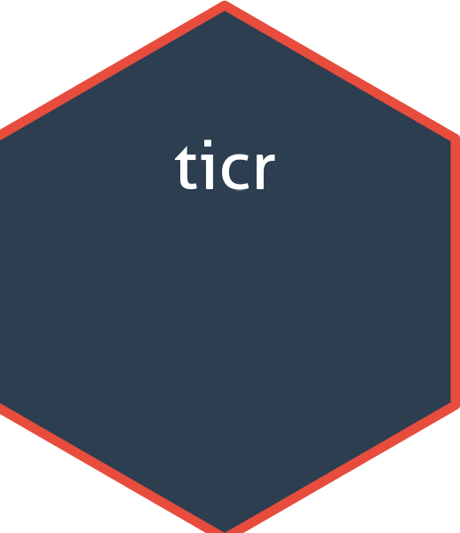

Markdown

📌 ticr 
<!-- badges: start -->

<!-- badges: end -->

The goal of **ticr** is to play the classic Tic-Tac-Toe game directly in your R console. This package was developed to demonstrate how to build interactive applications using R.

**Note:** This project was created with the assistance of **Gemini AI**, serving as a co-pilot for coding and package structure.

## Installation

You can install the development version of ticr from [GitHub](https://github.com/VladimirIvanov1987/ticr) with:
 r
📌 install.packages("pak")pak::pak("VladimirIvanov1987/ticr")

## Example

Here is how to start the game:
 r
library(ticr)

📌 Start a new game play_ticr()

Follow the instructions in the console to make your moves. Have fun!
